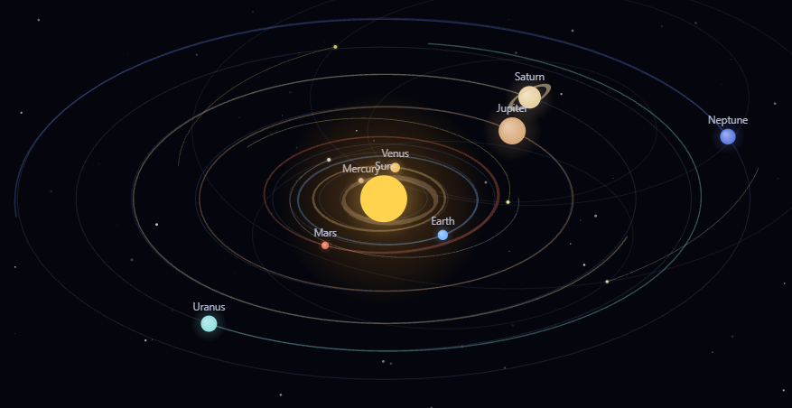

# Orbital

An interactive **N-body solar system simulator** with a parametric physics
dashboard. Every body attracts every other (`F = G·m₁·m₂/r²`), so the gravity /
mass / time controls genuinely reshape the orbits.

Written in **TypeScript** and compiled into a single, dependency-free
`index.html` by a small build script — no framework, no runtime dependencies.



## Features

- **Real N-body gravity** for the Sun, 8 planets, and comets — orbits respond
  live to the gravity, Sun-mass and time controls.
- **Moons** (Earth, Mars, Jupiter, Saturn) integrated in their parent's frame
  so they orbit their planet stably at the compressed visual scale.
- **Collisions** — overlapping bodies merge (momentum-conserving accretion)
  with a flash; toggleable.
- **Random system generator** — a star with up to 10 planets, each with up to
  4 moons (also resets all controls to defaults).
- **Launch Voyager 1** — a probe leaves Earth on a real escape trajectory and
  can pick up gravity assists from the planets it passes.
- **Asteroid belt + Oort cloud** as animated decorative particle belts.
- **Animated deep-space background** — drifting nebulae and slowly rotating
  spiral galaxies.
- **Terrestrial day counter** — elapsed time in Earth days (1 orbit = 365.25).
- **3D-ish view** — tilt/spin the orbital plane; depth-sorted rendering.
- **Info card** with a mini picture, type, mass, moons, distances and an
  estimated orbital period for any body you click.
- **Touch support** and a responsive, foldable dashboard for phones.

## Controls

| Control | Effect |
| --- | --- |
| **Time speed** | 0–0.2× simulation rate (default 0.10×) |
| **Gravity (G)** | 0–3× the gravitational constant — destabilizes or tightens orbits |
| **Sun mass** | 0.1–3× — reshapes every heliocentric orbit |
| **Zoom** + view toggles | trails, orbit paths, labels, realistic scale, collisions, belts |
| **Focus body** | camera follows any planet or moon |
| **Experiments** | Zero-G · Kick planets · Add comet · 🌟 Random system · 🛰️ Launch Voyager 1 |
| **Reset** | restore the real solar system and all defaults |

- **Mouse:** drag to pan · scroll to zoom · **click a body to show its info
  card** · hold **both buttons** and drag to tilt/spin the plane.
- **Touch:** drag to pan · pinch to zoom · two fingers to tilt/spin · tap a
  body for its card.
- **Keys:** `space` play/pause · `h` fold the menu · `0` reset the view.

The menu starts folded — click **☰** to open it; clicking outside folds it again.

## Build

Requires **Node ≥ 22.13** (24.x recommended). No `npm install` is needed to
build — type-stripping uses Node's built-in `module.stripTypeScriptTypes`.

```bash
./build.sh             # → writes ./index.html   (also: --open, --serve, --check)
# or:
node build.ts
```

Then open `index.html` in any modern browser.

Optional type-check: `npm install` then `npm run typecheck` (`tsc --noEmit`).

## Deploy with Docker

A multi-stage build regenerates `index.html` from source and serves it from a
tiny hardened nginx image (~48 MB, no Node in the final image).

```bash
./docker.sh            # build the image and run it → http://localhost:8088
./docker.sh stop       # stop & remove the container
docker compose up -d   # alternative, if you have the Compose plugin
```

Override port/name/image via env vars, e.g. `ORBITAL_PORT=9000 ./docker.sh`.

## Deploy on Unraid

Unraid often lacks the `docker compose` plugin, so the simplest path is a
**bind-mount bundle** — a stock nginx serving the prebuilt page, no build step
on the NAS.

1. **Make the bundle** (on your dev machine):

   ```bash
   ./bundle.sh          # → ./bundle/  (index.html, nginx.conf, Dockerfile,
                        #               docker-compose.yml, run.sh)
   ```

2. **Copy the folder to the NAS**, e.g. to `/mnt/user/appdata/orbital/`
   (SMB share, `scp`, or the Unraid file manager).

3. **Run it on the NAS** (SSH or the terminal):

   ```bash
   cd /mnt/user/appdata/orbital
   ./run.sh             # removes any old container, then starts a fresh one
   ```

   `run.sh` bind-mounts `index.html` + `nginx.conf` into `nginx:1.27-alpine` and
   exposes port **8088**. It's safe to re-run (it always replaces the old
   container). Override the port with `ORBITAL_PORT=9000 ./run.sh`.

4. Open **`http://<your-unraid-ip>:8088`**.

**Updating later:** overwrite `index.html` in that folder and refresh the
browser — no rebuild or restart needed (it's bind-mounted). To stop:
`docker rm -f orbital`.

If you *do* have the **Compose Manager** plugin, you can instead point it at the
bundle's `docker-compose.yml` (or run `docker compose up -d` in the folder).

## Project layout

```
src/main.ts        Simulation + rendering + UI (browser TypeScript)
src/styles.css     Dashboard / scene styling
src/template.ts    HTML shell; inlines the CSS + compiled JS
build.ts           Generator → strips types, writes index.html
build.sh           Convenience wrapper (build / --open / --serve / --check)
bundle.sh          Build a runtime-only deployment folder (for a NAS / server)
docker.sh          Build & run the production image locally
Dockerfile         Multi-stage image (build from source → nginx)
deploy/nginx.conf  nginx server config used by the images
index.html         ← GENERATED. Do not edit by hand.
```

## Notes

Distances and sizes are **stylized/compressed** so the system fits on screen and
planets stay visible (true scale would put Neptune far off-screen, and moons
inside their planet). The "Realistic scale" toggle sizes bodies by mass instead.
Physics constants are tuned for stable, good-looking orbits rather than SI units;
moon orbits intentionally drop tiny Sun-tidal terms so they stay bound at this
scale.
